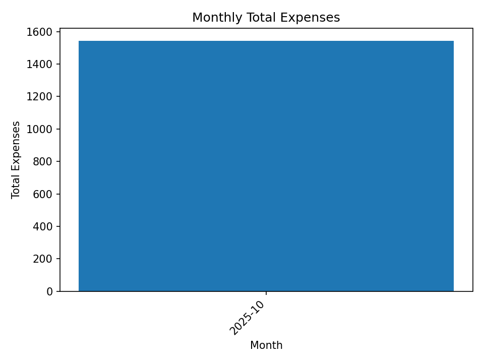
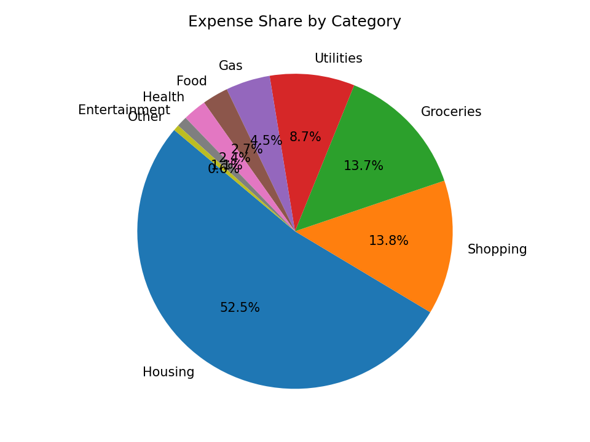
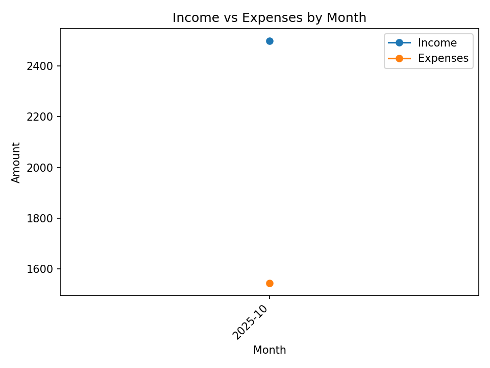

# Python Financial Analytics Tool

A Python-based CLI application that ingests transaction data, cleans it, generates summary tables, and produces visual insights into personal finances.

This project was built to demonstrate practical data analysis skills using realistic financial data, with an emphasis on clean code, modular design, and reproducibility.

---

## Overview

The tool processes a CSV file containing financial transactions and performs:

- data validation and cleaning  
- aggregation of expenses and income  
- generation of summary tables  
- creation of exportable visualizations  

The output can be used for quick financial analysis or as a foundation for more advanced analytics.

---

## Input Data Format

The input CSV must contain the following columns:

| Column | Description |
|------|------------|
| `date` | Transaction date in `YYYY-MM-DD` format |
| `description` | Merchant or transaction description |
| `amount` | Positive = income, Negative = expense |
| `category` | Transaction category |

Example:

```csv
date,description,amount,category
2025-10-01,Tim Hortons,-6.75,Food
2025-10-01,Salary,2500.00,Income
2025-10-03,Shell,-52.10,Gas
2025-10-05,Rent,-1450.00,Housing
2025-10-07,Amazon,-34.22,Shopping
```

## Data Cleaning Rules

The following cleaning rules are applied to the input data:

Rows with invalid dates or non-numeric amounts are removed

Rejected rows are logged to data/rejected_rows.csv for inspection

Whitespace is trimmed from descriptions and categories

Categories can optionally be normalized using a mapping file

## Example Console Output

After execution, the tool prints a concise summary:

```text
=== Console Summary ===
Total Income:   $2500.00
Total Expenses: $1543.07
Net:            $956.93

Top 5 Expense Categories:
1. Housing: $1450.00
2. Gas: $52.10
3. Shopping: $34.22
4. Food: $6.75
```

## Sample Visualizations

### Monthly Expenses


### Expense Breakdown by Category


### Income vs Expenses



## Summary Tables

outputs/monthly_spending_totals.csv

outputs/category_expense_totals.csv
## Notes

This project intentionally avoids heavy frameworks and advanced machine learning to focus on clarity, correctness, and core data analysis fundamentals.

The structure is designed to be easily extended for additional analytics features.

## Future Improvements

Date-range filtering via CLI flags

Case-insensitive category normalization

Monthly trend forecasting

Interactive dashboards
